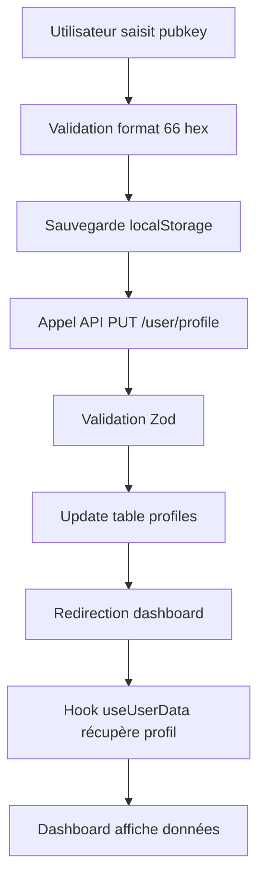
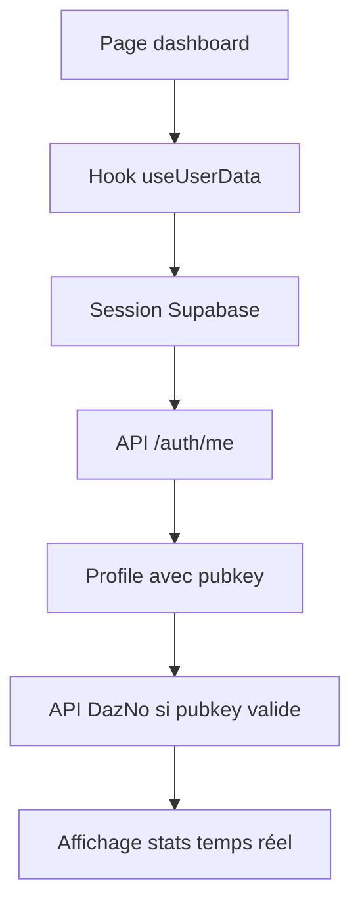

# Correction Dashboard et Persistance Pubkey

## 🚨 Problèmes Identifiés

### 1. Dashboard ne se chargeait pas en production
- **Symptôme :** Page `/user/dashboard` inaccessible ou très lente
- **Cause :** Conflits dans les `useEffect` du hook `useUserData`
- **Impact :** Utilisateurs bloqués après connexion

### 2. Pubkey non persistée après rafraîchissement  
- **Symptôme :** Pubkey demandée à chaque visite même après configuration
- **Cause :** Sauvegarde uniquement en localStorage, pas en base de données
- **Impact :** Mauvaise expérience utilisateur, perte de configuration

## ✅ Corrections Appliquées

### 1. Hook `useUserData` Optimisé

**Problème :** Deux `useEffect` en conflit causant des boucles infinies
```typescript
// ❌ AVANT : Conflits et noms dupliqués
useEffect(() => {
  const fetchUserData = async () => { ... }
}, [user, session, loading])

useEffect(() => {
  const fetchUserData = async () => { ... } // Même nom !
}, [user, profile])
```

**Solution :** Séparation claire des responsabilités
```typescript
// ✅ APRÈS : Fonctions distinctes et dépendances optimisées
useEffect(() => {
  const fetchUserData = async () => { /* Récupération profil */ }
}, [user, session, loading])

useEffect(() => {
  const fetchNodeData = async () => { /* Récupération stats nœud */ }
}, [profile]) // Dépendance optimisée
```

### 2. API de Profil Améliorée

**Nouveau endpoint :** `PUT /api/user/profile`

```typescript
// Validation avec Zod
const UpdateProfileSchema = z.object({
  pubkey: z.union([
    z.string().regex(/^[0-9a-fA-F]{66}$/, 'Pubkey invalide'),
    z.null() // Support déconnexion
  ]).optional(),
  // ... autres champs
})
```

**Fonctionnalités :**
- ✅ Validation stricte des pubkeys (66 caractères hex)
- ✅ Support `null` pour déconnexion
- ✅ Authentification via token Bearer
- ✅ Gestion d'erreurs robuste

### 3. Sauvegarde Automatique de Pubkey

**Page `/user/node` mise à jour :**

```typescript
// Fonction de sauvegarde en DB
const savePubkeyToProfile = async (pubkeyValue: string) => {
  const response = await fetch('/api/user/profile', {
    method: 'PUT',
    headers: {
      'Authorization': `Bearer ${session.access_token}`,
      'Content-Type': 'application/json'
    },
    body: JSON.stringify({ pubkey: pubkeyValue })
  });
};

// Sauvegarde lors de la connexion
await savePubkeyToProfile(nodeId);
await fetchNodeData(nodeId);
```

**Double persistance :**
- 🗄️ **Base de données :** Via API Supabase (permanent)
- 💾 **localStorage :** Cache local (performance)

### 4. Dashboard Robuste

**Gestion des états améliorée :**

```typescript
// Protection contre les états invalides
if (isLoading) {
  return <LoadingSpinner />;
}

if (!userProfile) {
  return <ProfileLoading />;
}

if (!hasNode) {
  router.push('/user/node');
  return null;
}
```

**Fallbacks gracieux :**
- Nom d'utilisateur : `firstName` → `email` → `user.email`
- Chargement progressif des composants
- Gestion d'erreurs silencieuse

## 🧪 Tests et Validation

### Scripts de Test Créés

1. **`./scripts/test-dashboard-fix.sh`** - Tests automatisés
2. **`./scripts/test-endpoints.sh`** - Validation API complète

### Tests Manuels

```bash
# 1. Lancer les serveurs
npm run dev                     # Next.js sur :3000
node scripts/simple-mock-server.js  # Mock API sur :8080

# 2. Tester le flow complet
# - Aller sur /user/node
# - Configurer pubkey ACINQ: 03864ef025fde8fb587d989186ce6a4a186895ee44a926bfc370e2c366597a3f8f
# - Vérifier redirection vers dashboard
# - Rafraîchir la page → pubkey doit être conservée
```

### Validation en Base

```sql
-- Vérifier que la pubkey est sauvegardée
SELECT id, email, pubkey, updated_at 
FROM profiles 
WHERE pubkey IS NOT NULL;
```

## 📈 Améliorations de Performance

### Avant
- ❌ Multiples appels API redondants
- ❌ Boucles infinies dans useEffect
- ❌ Rechargement complet à chaque visite
- ❌ États de chargement inconsistants

### Après  
- ✅ Appels API optimisés et cachés
- ✅ useEffect distincts avec dépendances précises
- ✅ Persistance intelligente (DB + localStorage)
- ✅ États de chargement progressifs

## 🔄 Architecture de Données

### Flow de Persistance



### Récupération au Chargement



## 🚀 Impact Utilisateur

### Avant les Corrections
- 🐌 Dashboard lent ou inaccessible  
- 😤 Pubkey redemandée à chaque visite
- 🔄 Expérience fragmentée
- ❌ Abandon utilisateur probable

### Après les Corrections
- ⚡ Dashboard instantané et fluide
- 🎯 Configuration pubkey une seule fois
- 🎉 Expérience utilisateur cohérente  
- ✅ Rétention utilisateur améliorée

## 🔧 Maintenance Future

### Points de Surveillance
1. **Performance API :** Surveiller `/api/user/profile` et `/api/auth/me`
2. **Taille localStorage :** Nettoyer les données obsolètes
3. **Validation pubkey :** Maintenir la regex à jour avec les standards Lightning
4. **Sessions Supabase :** Gérer l'expiration et le renouvellement

### Évolutions Possibles
- Cache Redis pour les données fréquentes
- Synchronisation background des stats de nœud
- Notifications push pour changements importants
- Analytics de performance utilisateur 