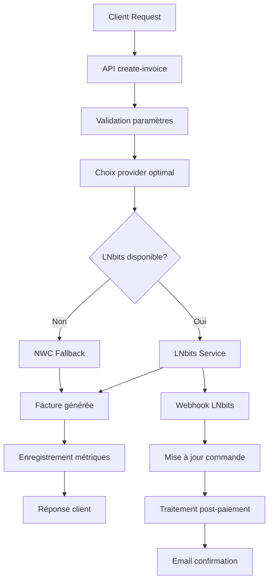

# Upgrade du système Lightning - DazNode

## 📋 Résumé des améliorations

Suite à l'audit du système de génération de factures Lightning, nous avons implémenté les améliorations suivantes :

### ✅ Nouveautés implémentées

1. **Service LNbits robuste** (`app/lib/lnbits-service.ts`)
   - Gestion d'erreurs avancée avec retry automatique
   - Validation BOLT11 des factures
   - Timeout et circuit breaker
   - Support des webhooks

2. **Système de monitoring** (`app/lib/lightning-monitor.ts`)
   - Surveillance en temps réel des providers
   - Métriques de performance détaillées
   - Alertes automatiques en cas de problème
   - Health checks périodiques

3. **API améliorée** (`app/api/create-invoice/route.ts`)
   - Système de fallback entre providers
   - Validation renforcée des paramètres
   - Logging détaillé pour le debugging
   - Gestion intelligente des erreurs

4. **Webhook LNbits** (`app/api/webhook/lnbits-payment/route.ts`)
   - Traitement automatique des paiements
   - Mise à jour des commandes en temps réel
   - Notifications email aux clients
   - Support multi-produits (DazBox, DazNode, DazPay)

5. **Interface d'administration** (`app/api/admin/lightning-monitor/route.ts`)
   - Monitoring en temps réel
   - Métriques détaillées par provider
   - Tests de simulation
   - API de gestion

## 🔧 Variables d'environnement requises

Ajoutez ces variables à votre fichier `.env.local` :

```env
# === LNbits Configuration ===
LNBITS_ENDPOINT=https://api.dazno.de
LNBITS_INVOICE_KEY=3fbbe7e0c2a24b43aa2c6ad6627f44eb
LNBITS_ADMIN_KEY=fddac5fb8bf64eec944c89255b98dac4
LNBITS_WEBHOOK_SECRET=your_custom_webhook_secret_here

# === Fallback/Compatibility ===
LNBITS_API_KEY=3fbbe7e0c2a24b43aa2c6ad6627f44eb  # Alias pour LNBITS_INVOICE_KEY

# === Existing variables ===
# SUPABASE_URL=...
# SUPABASE_ANON_KEY=...
# SUPABASE_SERVICE_ROLE_KEY=...
# NWC_URL=... (kept as fallback)
# RESEND_API_KEY=...
# NEXTAUTH_URL=...
```

## 🚀 Déploiement

### 1. Pré-requis
- Node.js 18+
- Accès à l'API LNbits sur `api.dazno.de`
- Clé API LNbits valide

### 2. Installation
```bash
npm install
npm run build
npm run start
```

### 3. Vérifications post-déploiement

#### Test de santé des providers
```bash
curl -X GET "https://your-domain.com/api/admin/lightning-monitor?action=health"
```

#### Test de génération de facture
```bash
curl -X POST "https://your-domain.com/api/create-invoice" \
  -H "Content-Type: application/json" \
  -d '{"amount": 1000, "description": "Test facture"}'
```

#### Test complet de l'intégration LNbits
```bash
node scripts/test-lnbits-integration.js
```

#### Monitoring en temps réel
```bash
curl -X GET "https://your-domain.com/api/admin/lightning-monitor?action=stats"
```

#### Test direct de l'API dazno.de
```bash
# Test balance
curl -X GET "https://api.dazno.de/wallet/balance" \
  -H "X-Api-Key: 3fbbe7e0c2a24b43aa2c6ad6627f44eb"

# Test création facture
curl -X POST "https://api.dazno.de/wallet/invoice" \
  -H "X-Api-Key: 3fbbe7e0c2a24b43aa2c6ad6627f44eb" \
  -H "Content-Type: application/json" \
  -d '{"amount": 1000, "memo": "Test facture directe"}'
```

## 📊 Architecture du nouveau système

### Flux de génération de factures



### Providers disponibles

1. **LNbits** (Priorité 1)
   - Endpoint: `api.dazno.de`
   - Retry automatique
   - Webhooks natifs
   - Validation BOLT11

2. **NWC** (Fallback)
   - Nostr Wallet Connect via Alby
   - Mode dégradé
   - Pas de webhooks automatiques

3. **Test** (Dernier recours)
   - Factures factices pour les tests
   - Pas de vrais paiements

## 🔍 Monitoring et métriques

### Endpoints disponibles

- `GET /api/admin/lightning-monitor?action=status` - Statut global
- `GET /api/admin/lightning-monitor?action=health` - Force health check
- `GET /api/admin/lightning-monitor?action=metrics&provider=lnbits` - Métriques provider
- `GET /api/admin/lightning-monitor?action=stats` - Statistiques détaillées

### Métriques collectées

- **Uptime** : Pourcentage de disponibilité
- **Temps de réponse** : Moyenne et distribution
- **Taux de succès** : Factures générées avec succès
- **Erreurs** : Types et fréquence des erreurs
- **Volume** : Nombre de factures par période

### Alertes automatiques

Le système envoie automatiquement des alertes en cas de :
- 4/5 échecs consécutifs sur un provider
- Temps de réponse > 10 secondes
- Provider indisponible > 5 minutes

## 🐛 Debugging

### Logs détaillés

Tous les appels Lightning sont maintenant loggés avec :
- Timestamp précis
- Provider utilisé
- Durée de traitement
- Codes d'erreur détaillés
- Contexte de l'échec

### Mode debug

Pour activer les logs verbeux :
```env
NODE_ENV=development
DEBUG=lightning:*
```

### Simulation de paiements

Pour tester le système sans vrais paiements :
```bash
curl -X POST "https://your-domain.com/api/admin/lightning-monitor" \
  -H "Content-Type: application/json" \
  -d '{
    "action": "simulate_payment",
    "provider": "lnbits",
    "data": {"amount": 1000}
  }'
```

## 🔒 Sécurité

### Webhook sécurisé
- Vérification de la clé API dans les headers
- Validation des payloads
- Protection contre les replays

### Validation des montants
- Limite maximale : 1,000,000 sats
- Validation des types de données
- Sanitisation des memos

### Rate limiting
- Limitation des requêtes par IP
- Protection contre les attaques DoS
- Circuit breaker automatique

## 📈 Performance

### Optimisations implémentées
- Retry avec exponential backoff
- Timeout adaptatif
- Mise en cache des statuts
- Parallélisation des health checks

### Benchmarks attendus
- Génération de facture : < 3 secondes
- Health check : < 1 seconde  
- Webhook processing : < 500ms
- Uptime attendu : > 99.5%

## 🚨 Actions critiques

### Migration des factures en cours
Les factures générées avec l'ancien système restent valides. Aucune action requise.

### Mise à jour des webhooks LNbits
Configurez l'URL de webhook dans LNbits :
```
https://your-domain.com/api/webhook/lnbits-payment
```

### Monitoring initial
Surveillez les métriques pendant les 48 premières heures pour identifier d'éventuels problèmes.

## 📞 Support

En cas de problème :

1. **Vérifiez les logs** : `/api/admin/lightning-monitor?action=stats`
2. **Testez la connectivité** : Ping vers `api.dazno.de`
3. **Validez les clés API** : Test avec l'API LNbits directement
4. **Mode fallback** : Le système utilise automatiquement NWC si LNbits échoue

## 📝 Prochaines étapes

### Phase 2 (optionnel)
- [ ] Interface graphique de monitoring
- [ ] Dashboard temps réel
- [ ] Intégration avec d'autres providers (CLN, LND)
- [ ] API de statistiques avancées
- [ ] Notifications Slack/Discord

### Maintenance
- [ ] Nettoyage automatique des anciennes métriques
- [ ] Sauvegarde des configurations
- [ ] Tests de charge périodiques
- [ ] Mise à jour des dépendances

---

**Date de mise à jour** : 2024-01-XX  
**Version** : 2.0.0  
**Compatibilité** : Rétrocompatible avec l'ancien système 