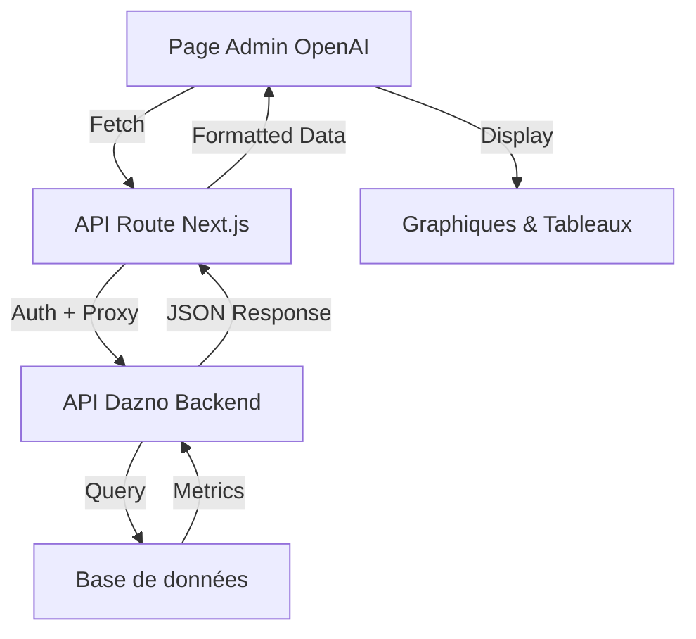

# Intégration Frontend/Backend - Métriques OpenAI

## Architecture complète

### Backend (API Dazno - Python/FastAPI)

#### Modèles de données (`app/models/usage_metrics.py`)
- **UsageMetric** : Stocke les métriques d'usage (OpenAI, appels API)
- **RecommendationMetric** : Stocke toutes les recommandations transmises
- **Modèles Pydantic** : Validation et sérialisation des réponses API

#### Service de métriques (`app/services/metrics_service.py`)
- Enregistrement automatique des appels OpenAI (tokens, coûts, temps)
- Enregistrement des recommandations générées
- Agrégation des données pour analyses
- Génération d'alertes automatiques

#### Routes backoffice (`app/routes/backoffice.py`)
| Endpoint | Description | Utilisé par |
|----------|-------------|-------------|
| `/api/v1/backoffice/metrics` | Métriques complètes avec période | Page principale OpenAI |
| `/api/v1/backoffice/metrics/openai` | Usage OpenAI détaillé | (Disponible pour extension) |
| `/api/v1/backoffice/metrics/recommendations` | Stats recommandations | (Disponible pour extension) |
| `/api/v1/backoffice/metrics/system` | Métriques système | (Disponible pour extension) |
| `/api/v1/backoffice/metrics/realtime` | Activité temps réel | Rafraîchissement auto |
| `/api/v1/backoffice/health/detailed` | État de santé | Section santé système ✅ |

#### Middleware de tracking (`app/middleware/metrics_tracking.py`)
- Enregistrement automatique de tous les appels API
- Mesure du temps de réponse
- Extraction du pubkey depuis l'URL

### Frontend (Next.js/React)

#### Page OpenAI (`app/admin/openai/page.tsx`)
- Interface utilisateur complète
- Graphiques interactifs avec Recharts
- Rafraîchissement automatique des données temps réel
- Gestion des alertes et erreurs

#### API Routes (`app/api/admin/openai/`)
- **`/metrics/route.ts`** : Proxy vers l'API backend avec authentification
- **`/metrics/realtime/route.ts`** : Proxy pour les données temps réel
- **`/health/route.ts`** : Proxy pour l'état de santé du système

## Flux de données



## Métriques affichées

### 📊 Usage OpenAI
- **Nombre total de requêtes** : Affiché dans la carte "Requêtes Totales"
- **Tokens utilisés** : Carte dédiée avec détail prompt/completion
- **Coût estimé** : Carte principale avec projection mensuelle
- **Répartition par modèle** : Graphique camembert
- **Top pubkeys** : Tableau avec tokens et requêtes
- **Évolution quotidienne** : Graphique linéaire double axe

### 🎯 Recommandations
- **Total des recommandations** : Affiché dans le titre du graphique
- **Répartition par type** : Graphique en barres
- **Taux de consultation** : Statistique sous le graphique
- **Taux d'implémentation** : Statistique sous le graphique
- **Historique récent** : Intégré dans l'activité récente

### 🖥️ Système
- **Appels API par endpoint** : Tableau des performances
- **Temps de réponse moyen** : Code couleur (vert/orange)
- **Taux d'erreur** : Affiché avec alerte si > 5%
- **Taux de hit du cache** : Dans la carte "Nœuds Actifs"
- **Nœuds actifs suivis** : Carte dédiée

### 🔔 Alertes automatiques
Les alertes sont affichées en haut de la page si présentes :
- **Coût élevé** : > 100$ sur la période
- **Taux d'erreur élevé** : > 5%
- **Performance dégradée** : > 2000ms

### 📈 Projections
Affichées dans la carte "Coût Total" :
- Coût journalier moyen
- Projection mensuelle
- Projection annuelle (dans les données mais pas affichée)

### 🏥 État de santé système
- **Statut global** : Affiché avec indicateur visuel (✅/⚠️)
- **Composants surveillés** :
  - Database : État de la connexion PostgreSQL
  - Cache : État de Redis
  - SparkSeer : API externe pour les données Lightning
  - OpenAI : API OpenAI
- **Rafraîchissement** : Toutes les 60 secondes avec les métriques temps réel

## Configuration et déploiement

### Variables d'environnement requises

```env
# Frontend (Next.js)
DAZNO_API_BASE_URL=https://api.dazno.de
DAZNO_API_TOKEN=your_bearer_token_here

# Backend (FastAPI) - déjà configuré
DATABASE_URL=postgresql://...
REDIS_URL=redis://...
OPENAI_API_KEY=sk-...
```

### Authentification

1. **Frontend** : Middleware `withAdmin` vérifie l'authentification Supabase
2. **API Route** : Ajoute le Bearer token pour l'API backend
3. **Backend** : Vérifie le JWT ou X-API-Key

### Optimisations implémentées

1. **Cache** :
   - Métriques principales : Cache de 5 minutes côté backend
   - Temps réel : Pas de cache (`cache: "no-store"`)

2. **Performance** :
   - Pagination automatique des listes
   - Limitation à 10 éléments pour les tableaux
   - Graphiques optimisés avec Recharts

3. **UX** :
   - Skeleton loading pendant le chargement
   - Messages d'erreur contextuels
   - Rafraîchissement automatique configurable

## Extensions possibles

### 1. Endpoints non utilisés
Les endpoints suivants sont disponibles mais pas encore intégrés :
- `/metrics/openai` : Pour une vue détaillée OpenAI uniquement
- `/metrics/recommendations` : Pour filtrer par type de recommandation
- `/metrics/system` : Pour un dashboard système dédié
- `/health/detailed` : Pour un monitoring en temps réel

### 2. Fonctionnalités additionnelles
- [ ] Export CSV des données
- [ ] Filtrage par date personnalisé
- [ ] Drill-down sur les pubkeys
- [ ] Webhooks pour alertes critiques
- [ ] Mode comparaison entre périodes

### 3. Visualisations supplémentaires
- [ ] Heatmap des heures d'utilisation
- [ ] Graphique de corrélation coût/performance
- [ ] Carte géographique des nœuds
- [ ] Timeline des recommandations

## Debugging

### Logs utiles

```typescript
// Frontend - Vérifier les appels API
console.log('Fetching metrics with period:', periodDays);
console.log('Metrics response:', data);

// Backend - Vérifier les requêtes
logger.info(f"Backoffice metrics requested for {period_days} days")
logger.debug(f"OpenAI usage: {openai_stats}")
```

### Erreurs communes

1. **401 Unauthorized** : Vérifier DAZNO_API_TOKEN
2. **CORS errors** : Proxy via API Routes Next.js
3. **Données manquantes** : Vérifier les logs backend
4. **Graphiques vides** : Vérifier le format des données

## Monitoring

### Métriques à surveiller
- Temps de réponse de l'API backend
- Taux d'erreur des endpoints
- Utilisation mémoire des graphiques
- Fréquence des rafraîchissements

### Alertes recommandées
- Échec de connexion à l'API > 3 fois
- Temps de chargement > 5 secondes
- Erreur de parsing des données
- Token expiré ou invalide

## Changelog

### Version 1.1 (Ajout état de santé)
- ✅ Ajout de la section "État de santé du système"
- ✅ Création de l'endpoint `/api/admin/openai/health`
- ✅ Intégration avec l'endpoint backend `/health/detailed`
- ✅ Rafraîchissement automatique toutes les 60 secondes
- ✅ Indicateurs visuels pour chaque composant

### Version 1.0 (Version initiale)
- Page OpenAI avec métriques complètes
- Graphiques interactifs (Recharts)
- Métriques temps réel
- Système d'alertes
- Projections de coûts