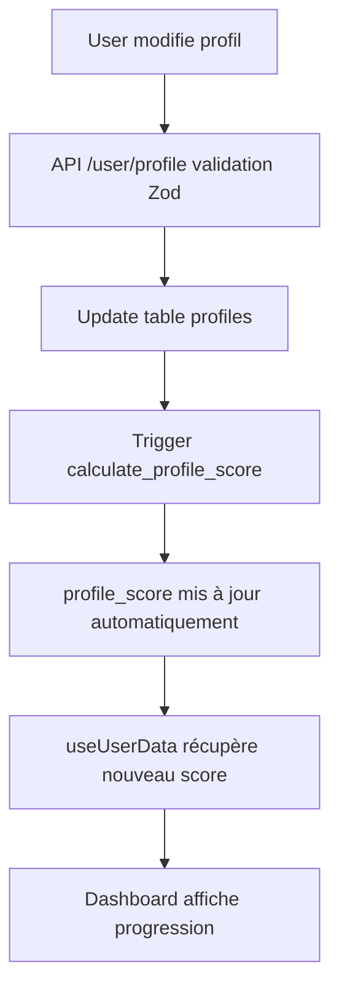

# Correction Complète du Système de Score Utilisateur

## 🔍 Problèmes Identifiés

### 1. **Incohérences de Noms de Champs**
- ❌ Hook utilise `twitterHandle` → DB utilise `compte_x`
- ❌ Hook utilise `nostrPubkey` → DB utilise `compte_nostr` 
- ❌ Hook utilise `phoneVerified` → DB n'a pas ce champ

### 2. **Contraintes de Sécurité Manquantes**
- ❌ Pas de contrainte d'unicité sur `pubkey` → Conflits possibles
- ❌ Pas de validation format des champs critiques

### 3. **Champs Manquants pour Score Complet**
- ❌ Pas de champ `phone` dans la table profiles
- ❌ Pas de champ `phone_verified` dans la table profiles
- ❌ Score non persisté en base de données

## ✅ Corrections Appliquées

### 1. **Migration Base de Données**
```sql
-- Ajout champs manquants
ALTER TABLE profiles ADD COLUMN phone_verified BOOLEAN DEFAULT FALSE;
ALTER TABLE profiles ADD COLUMN phone TEXT;

-- Contraintes d'unicité critiques
ALTER TABLE profiles ADD CONSTRAINT unique_pubkey UNIQUE(pubkey);
ALTER TABLE profiles ADD CONSTRAINT unique_email UNIQUE(email);

-- Validation formats
ALTER TABLE profiles ADD CONSTRAINT valid_pubkey_format 
CHECK (pubkey IS NULL OR pubkey ~ '^[0-9a-fA-F]{66}$');
```

### 2. **Calcul Automatique du Score**
```sql
-- Fonction de calcul du score (0-100 points)
CREATE FUNCTION calculate_profile_score(profile_record profiles)
RETURNS INTEGER AS $$
  -- Email vérifié: 20 points
  -- Pubkey renseignée: 20 points  
  -- Twitter/X: 20 points
  -- Nostr: 20 points
  -- Téléphone vérifié: 20 points
$$;

-- Trigger automatique
CREATE TRIGGER trigger_update_profile_score
  BEFORE INSERT OR UPDATE ON profiles
  FOR EACH ROW EXECUTE FUNCTION update_profile_score();
```

### 3. **Types TypeScript Harmonisés**
```typescript
interface UserProfile {
  // Champs DB principaux
  nom?: string;
  prenom?: string;
  compte_x?: string;
  compte_nostr?: string;
  phone?: string;
  phone_verified?: boolean;
  profile_score?: number;
  
  // Alias de compatibilité
  firstName?: string;
  lastName?: string;
  twitterHandle?: string;
  nostrPubkey?: string;
  phoneVerified?: boolean;
}
```

### 4. **Hook useUserData Corrigé**
```typescript
// Calcul basé sur les vrais champs DB
const fields: ProfileField[] = [
  { completed: !!profile?.email_verified },      // ✅ Email
  { completed: !!profile?.pubkey },              // ✅ Pubkey
  { completed: !!profile?.compte_x },            // ✅ Twitter (corrigé)
  { completed: !!profile?.compte_nostr },        // ✅ Nostr (corrigé)
  { completed: !!profile?.phone_verified },      // ✅ Phone (corrigé)
];
```

### 5. **API /user/profile Étendue**
```typescript
// Validation Zod complète
const UpdateProfileSchema = z.object({
  nom: z.string().optional(),
  prenom: z.string().optional(),
  pubkey: z.union([z.string().regex(/^[0-9a-fA-F]{66}$/), z.null()]).optional(),
  compte_x: z.string().optional(),
  compte_nostr: z.string().optional(),
  phone: z.string().regex(/^\+?[1-9]\d{1,14}$/).optional(),
  phone_verified: z.boolean().optional(),
});
```

## 🧪 Tests de Validation

### 1. **Test de Progression du Score**
```bash
# Script de test automatique
curl -X PUT /api/user/profile \
  -H "Authorization: Bearer $TOKEN" \
  -d '{"compte_x": "@moncompte"}' \
# → Score doit passer de X à X+20

curl -X PUT /api/user/profile \
  -H "Authorization: Bearer $TOKEN" \
  -d '{"compte_nostr": "npub1..."}' \
# → Score doit passer de X+20 à X+40
```

### 2. **Test de Contrainte d'Unicité Pubkey**
```bash
# Première insertion: OK
curl -X PUT /api/user/profile \
  -d '{"pubkey": "03864ef025fde8fb587d989186ce6a4a186895ee44a926bfc370e2c366597a3f8f"}'

# Deuxième utilisateur même pubkey: ERREUR attendue
curl -X PUT /api/user/profile \
  -d '{"pubkey": "03864ef025fde8fb587d989186ce6a4a186895ee44a926bfc370e2c366597a3f8f"}'
# → Doit retourner erreur de conflit
```

### 3. **Test d'Affichage en Temps Réel**
```typescript
// Dashboard doit afficher progression immédiate
1. Aller sur /user/settings
2. Renseigner compte Twitter → Score +20 instantané
3. Renseigner compte Nostr → Score +20 instantané  
4. Vérifier téléphone → Score +20 instantané
```

## 📊 Système de Score Final

### Points par Champ (20 points chacun)
| Champ | Condition | Points | Statut |
|-------|-----------|--------|--------|
| **Email** | `email_verified = true` | 20 | ✅ Auto |
| **Nœud Lightning** | `pubkey IS NOT NULL` | 20 | ✅ Manuel |
| **Twitter/X** | `compte_x IS NOT NULL` | 20 | ✅ Manuel |
| **Nostr** | `compte_nostr IS NOT NULL` | 20 | ✅ Manuel |
| **Téléphone** | `phone_verified = true` | 20 | ⏳ À implémenter |

### Score Total
- **Minimum:** 0 points (profil vide)
- **Maximum:** 100 points (profil complet)
- **Calcul:** Automatique via trigger SQL
- **Affichage:** Temps réel dans dashboard

## 🎯 Expérience Utilisateur

### Avant les Corrections
```
❌ Utilisateur renseigne Twitter → Score ne bouge pas
❌ Utilisateur renseigne Nostr → Score ne bouge pas  
❌ Pas de feedback visuel sur progression
❌ Pubkey peut être dupliquée
```

### Après les Corrections
```
✅ Utilisateur renseigne Twitter → Score +20 immédiat
✅ Utilisateur renseigne Nostr → Score +20 immédiat
✅ Dashboard affiche progression en temps réel
✅ Pubkey unique = sécurité garantie
✅ Contraintes DB empêchent données corrompues
```

## 🔄 Flow de Mise à Jour



## 🚀 Déploiement

### 1. **Migration Supabase**
```bash
# Appliquer la migration
supabase db push supabase/migrations/fix_profile_fields_and_constraints.sql
```

### 2. **Tests Post-Déploiement**
```bash
# Vérifier contraintes
psql -c "SELECT COUNT(*) FROM profiles WHERE pubkey IS NOT NULL GROUP BY pubkey HAVING COUNT(*) > 1;"
# → Doit retourner 0 ligne

# Vérifier calcul scores
psql -c "SELECT email, profile_score, calculate_profile_score(profiles.*) FROM profiles LIMIT 5;"
# → profile_score doit égaler calculate_profile_score
```

### 3. **Monitoring**
```sql
-- Vue des statistiques de profil
SELECT * FROM profile_completion_stats;

-- Utilisateurs avec score maximum
SELECT email, profile_score FROM profiles WHERE profile_score = 100;

-- Progression moyenne des utilisateurs
SELECT AVG(profile_score) as score_moyen FROM profiles;
```

## 🔮 Évolutions Futures

### Phase 2: Gamification Avancée
- 🏆 Système de badges pour actions spéciales
- 📈 Historique de progression des scores
- 🎁 Récompenses pour profils complets
- 📱 Notifications push sur progression

### Phase 3: Analytics Avancées
- 📊 Funnel de conversion par champ
- 🎯 A/B testing sur les incitations
- 📈 Corrélation score ↔ rétention
- 🔄 Optimisation basée sur les données

### Phase 4: Intégrations Sociales
- 🐦 Vérification automatique Twitter via API
- ⚡ Vérification automatique Nostr via NIP-05
- 📞 Vérification SMS automatique
- 🔗 Import automatique depuis autres plateformes 